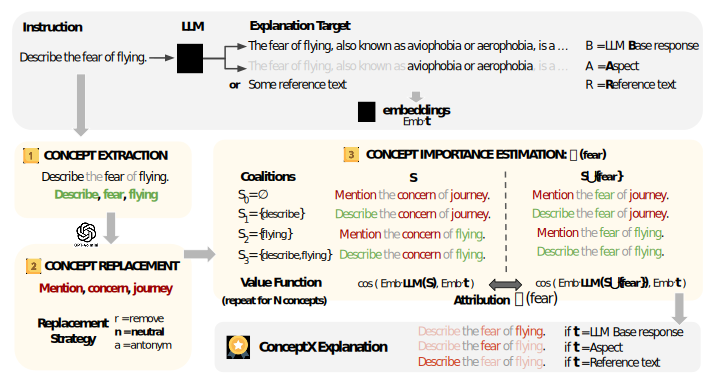

<p align="center">
    
  </p>
  
  
  # ConceptX: Concept-Level Explainability for Auditing and Steering LLM Responses
  
  This is the code to implement ConceptX method
  (see [papers](#citations) for details and citations).
  
  ## Getting Started
  
  ### Prerequisites
  
  This code was tested with Python 3.8.5.
  
  ### Installation
  
  Load the Python packages:
  ```
  pip install -r requirements.txt
  ```
  
  ### Datasets
  
  Download the datasets from the following links: https://figshare.com/ndownloader/articles/25202657/versions/1
  
  If you download and use these datasets in your research, please cite the following paper:
  
  ```
  Amara, Kenza (2025). SyntaxShap datasets. figshare. Dataset. https://doi.org/10.6084/m9.figshare.25202657.v1
  ```
  
  ### Pre-trained models
  
  The pre-trained language models were extracted from the Hugging Face model hub.
  - MistralAI 7B: https://huggingface.co/mistralai/Mistral-7B-Instruct-v0.2
  - Gemma-3-3B:

  - GPT-4o mini: 
  
  
  
  ## Usage
  
  To generate explanations by explainer, you can use the following commands:
  
  ```bash
  python src/explain.py --dataset [dataset] --model_name [model_name] --explainer [explainer] --seed [seed]
  ```
  
  The following parameters are available:
  - dataset: the name of the dataset to use "negation", "generics", "rocstories"
  - model_name: the name of the decoder language model to use "gpt2", "mistral"
  - explainer: the name of the explainability method to use "lime", "shap", "partition", "syntax", "syntax-w"
  - seed: the random seed to use for reproducibility (e.g. 0)
  
  
  ## Citation
  If you are using ConceptX code, please cite the following paper:
  ```
  @article{Anonymous,
    title={Concept-Level Explainability for Auditing and Steering LLM Responses},
    author={Anonymous},
    journal={Anonymous},
    year={2025}
  }
  ```
  For any questions about this code please file an github [issue](https://github.com/).
  
  
  ## References
  
  1. *LIME:* Ribeiro, Marco Tulio, Sameer Singh, and Carlos Guestrin. "Why should i trust you?: Explaining the predictions of any classifier." Proceedings of the 22nd ACM SIGKDD International Conference on Knowledge Discovery and Data Mining. ACM, 2016.
  
  2. *Shapley sampling values:* Strumbelj, Erik, and Igor Kononenko. "Explaining prediction models and individual predictions with feature contributions." Knowledge and information systems 41.3 (2014): 647-665.
  
  3. *Partition* Chen, Hanjie, Guangtao Zheng, and Yangfeng Ji. "Generating hierarchical explanations on text classification via feature interaction detection." arXiv preprint arXiv:2004.02015 (2020).